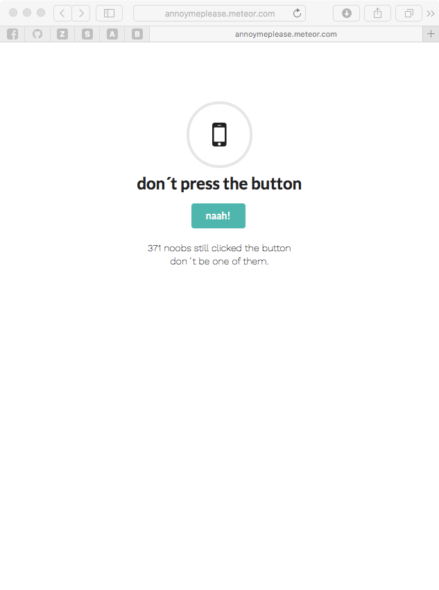
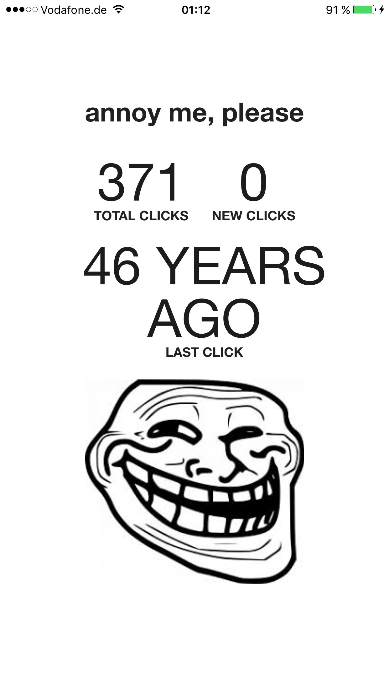

#annoymeplease

annoymeplease is a tech demo written with meteorJS. 
with annoymeplease users can click on a button via a webbrowser to let your smartphone vibrate.

##browser

##app

##demo

browser demo is available <a target="_blank" href="http://annoymeplease.meteor.com">here</a>
